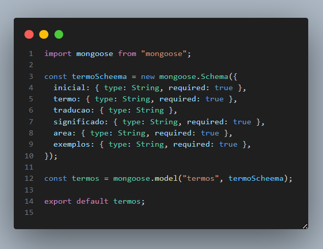
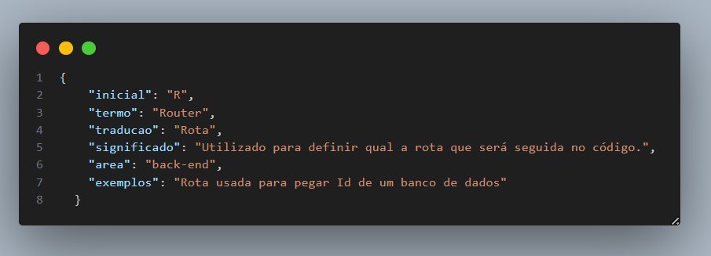

# :books: DicioTech - Documentação Tecnica Back-End

<br>

### Arquitetura, Funcionalidades e Demonstração da Aplicação do projeto Diciotech, desenvolvido por alunas do Senac em parceria com Porto Digital.

<br>

## :ledger: Tecnologias Utilizadas

| Ferramenta    | Descrição                                                       |
| ------------- | --------------------------------------------------------------- |
| `javascript`  | Linguagem de programação.                                       |
| `node.js`     | Ambiente de execução do javascript.                             |
| `npm`         | Gerenciador de pacotes.                                         |
| `MongoDb`     | Banco de dados não relacional orietado a documentos.            |
| `Mongo Atlas` | Interface gráfica para verificar se os dados foram persistidos. |
| `Postman`     | Interface gráfica para realizar os testes.                      |

<br>

## :bookmark: Pacotes Utilizados

| Ferramenta | Descrição                                                                                                |
| ---------- | -------------------------------------------------------------------------------------------------------- |
| `express`  | Framework NodeJS.                                                                                        |
| `mongoose` | Dependência que interage com o MongoDB para a conexão da database, criação do model e das collections.   |
| `nodemon`  | Dependência que observa as atualizações realizadas nos documentos para rodar o servidor automaticamente. |
| `npm`      | Gerenciador de pacotes.                                                                                  |

<br>

---

 <h2> 📁 Arquitetura do Projeto </h2>

```
 📁DicioTech
   |
   |--📁node_modules
   |
   |--📁 src
   |
   |  ||--📁 assets
   |  |    |- 📄 testandorotas.mp4
   |  |    |- 📄 models.png
   |  |    |- 📄 termos.png
   |  ||
   |  ||--📁 config
   |  |    |- 📄 dbConnect.js
   |  ||
   |  ||--📁 controllers
   |  |    |- 📄 termosController.js
   |  |
   |  ||--📁 models
   |  |    |- 📄 termos.js
   |  |    |- 📄 termo.json
   |  |
   |  ||--📁 routes
   |  |    |- 📄 termo.js
   |  |    |- 📄 index.js
   |  |
   |  ||-📄 app.js
   |  |
   |- 📄 .gitignore
   |- 📄 package-lock.json
   |- 📄 package.json
   |- 📄 README.md
   |- 📄 server.js


```

<br>

## :repeat_one: Interface Gráfica Para Realizar os Testes

Este projeto está com os métodos HTTP organizados. Você pode testar as rotas Get, Post,Delete e Update através de qualquer ferramenta API REST, como Insomnia, Thunder Client, Postman, entre outros. Nesse projeto, utilizamos o [Postman](https://www.postman.com/downloads/).

<br>

## :on: Testando Rotas

https://github.com/GiselePorto/DicioTech/assets/132604471/0564ec01-3eb7-4d63-b3f2-6cf2a62d6705

## Os métodos e rotas serão:

| Verbo  | EndPoint  | Descrição do Rota                               |
| ------ | --------- | ----------------------------------------------- |
| GET    | /Termos   | Listar todos as Termos cadastrados              |
| GET    | /:id      | Mostra o cadastro do Termo por ID               |
| GET    | /:Area    | Mostra o cadastro do Termo por Categoria        |
| GET    | /:Inicial | Mostra o cadastro do Termo por Categoria        |
| POST   | /:id      | Registra um novo Termo                          |
| PUT    | /:id      | Altera dados do Termo identificado pelo ID      |
| DELETE | /:id      | Remove o cadastro do Termo identificado pelo ID |
| DELETE | /Termos   | Remove o cadastro de todos os termos            |

<br>

## Modelo de Esquema Mongoose para Termos



<br>

## Exemplo de Inserção de Dados



<br>

## :heavy_plus_sign: Clonar e Contribuir para o Projeto

Este documento fornece instruções técnicas sobre como com o projeto. O processo de clonar e contribuir, envolve o uso de comandos do Git para clonar o repositório, criar uma ramificação, fazer alterações e enviar um pedido de pull. Siga as etapas abaixo para começar:

<br>

## :warning: Pré-requisitos

Antes de prosseguir, certifique-se de ter o Git instalado no seu sistema. Caso contrário, você pode baixá-lo e instalá-lo a partir do site oficial do Git (https://git-scm.com/).

<br>

### Clonar o Repositório

1. Abra o terminal ou prompt de comando.

2. Navegue até o diretório onde deseja clonar o repositório.

3. Execute o seguinte comando para clonar o repositório para o seu sistema local:

```git
git clone https://github.com/DevasSenac/DicioTech.git
```

<br>

### Criar uma Ramificação (Branch)

1. Navegue para o diretório do projeto clonado usando o comando `cd DicioTech`.

2. Execute o seguinte comando para criar uma nova ramificação (branch) para trabalhar nas suas alterações:

```git
git checkout -b <nome_da_branch>
```

Substitua `<nome_da_branch>` pelo nome descritivo da branch que você deseja criar.

<br>

### Fazer Alterações

1. Abra o projeto clonado em seu editor de código.

2. Faça as alterações desejadas nos arquivos.

<br>

### Commit das Alterações

1. Volte para o terminal ou prompt de comando.

2. Execute o seguinte comando para adicionar as alterações ao seu controle de versão:

```git
git add .
```

_Esse comando adicionará todos as alterações feitas aos arquivos no diretório atual.
_ 3. Em seguida, execute o seguinte comando para criar um commit com uma mensagem descritiva das alterações:

```git
git commit -m "Mensagem do commit"
```

<br>

### Enviar um Pedido de Pull Request

1. Execute o seguinte comando para enviar sua ramificação (branch) e as alterações para o repositório remoto no GitHub:

```git
git push origin <nome_da_branch>
```

Substitua `<main>` pelo nome da branch que você criou anteriormente.

2. Acesse o repositório no GitHub.

3. Clique no botão "Compare & pull request" (ou similar) ao lado da sua ramificação no repositório.

4. Preencha os detalhes do seu pedido de pull (pull request), incluindo uma descrição clara das alterações realizadas.

5. Clique em "Create pull request" para enviar o pedido de pull.

<br>

## :triangular_flag_on_post: Implementações Futuras 

- Implementar mais rotas para a busca de termos.

- Integrar banco de dados com Quiz interativo.

- Utilizar de dados para futura Gameficação do Diciotech.

- Expandir Diciotech para outras áreas, consequentemente, seu banco de dados.

 <br>

## :triangular_flag_on_post: Status Do Projeto

O projeto está concluído, o que significa que novas funcionalidades e melhorias foram  integradas com sucesso. Fique à vontade para acompanhar o repositório para obter as últimas atualizações e contribuir com o projeto.

<br>

## Autoras :

## Delis Glória

- [Linkedin](https://www.linkedin.com/in/delis-guerra-46b63614a/)
- [Github](https://github.com/DelisG)

## Ingrid

- [Linkedin](https://www.linkedin.com/in/ingridecsilva/)
- [Github](https://github.com/diimartell)

## Glaucy

- [Linkedin](https://www.linkedin.com/in/glaucy-ara%C3%BAjo-b97a80b1/?originalSubdomain=br)
- [Github](https://github.com/glaucyaraujo)

## Renata Silvestre

- [Linkedin](https://www.linkedin.com/in/renatasilvestr3/)
- [Github](https://github.com/renatasilvestr3)

## Geovanna Lima

- [Linkedin](https://www.linkedin.com/in/geovanawlima/)
- [Github](https://github.com/geovanaw)

## Gisele Porto

- [Linkedin](https://www.linkedin.com/in/giseleporto/)
- [Github](https://github.com/GiselePorto)

</span>
